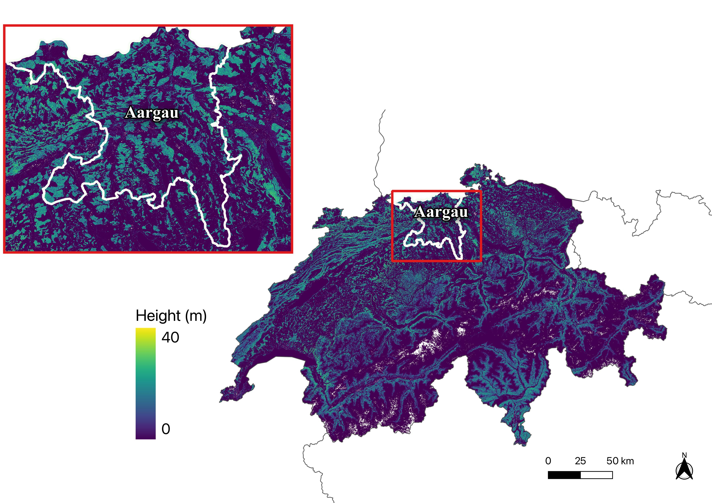

# veg-height-map-public
Countrywide Vegetation Height Estimation with Sentinel-2 and Deep Learning

## :evergreen_tree: Data Availability :evergreen_tree:
The generated vegetation height maps of Switzerland (including both the mean & max height) are public accessible [please download here](https://doi.org/10.5281/zenodo.8283347)
- resolution: 10m-resolution
- temporal coverage: 2017, 2018, 2019, 2020
- spatial coverage: the whole Switzerland




## Requirements

- Python 3.8.5
- PyTorch: 1.7.1+cu110 (gcc/6.3.0, cudnn/8.0.5, cuda/11.0.3)
- HDF5/1.10.1
- GDAL/3.1.2

## Preproccessing
- generate image stats
```
sbatch --time=24:00:00 --job-name=calstats --mem-per-cpu=16G --output logs/stats.out --cpus-per-task=3 --wrap="python -m scripts.calculate_stats --img=True --preproconfig=configs/preprocess.yaml"
```

- preprocess images
```
sbatch --time=24:00:00 --job-name=preprocess_euler --mem-per-cpu=16G --output logs/preprocess.out --cpus-per-task=5 --wrap="python -m scripts.preprocess_img --preproconfig=configs/preprocess.yaml"
```
- normalise images/labels
```
sbatch --time=4:00:00 --job-name=calstats --mem-per-cpu=16G --output logs/norm_stats.out --cpus-per-task=8 --wrap="python -m scripts.calculate_stats --preproconfig=configs/train_spyr.yaml"
```
- normalise DTM
```
sbatch --job-name=calstats --time=4:00:00 --mem-per-cpu=16G --output logs/dtm_stats.out --cpus-per-task=3 --wrap="python -m scripts.calculate_stats --preproconfig=configs/train_spyr.yaml --dtm True"
```

## Training
- train with DTM
```
sbatch --time=120:00:00 --job-name=train --gpus=1 --mem-per-cpu=16G --output logs/train_dtm.out --cpus-per-task=8 --wrap="python -m scripts.train --config=configs/train_spyr.yaml"
```
- train without DTM
```
sbatch --time=120:00:00 --job-name=trainnd --gpus=1 --mem-per-cpu=16G --output logs/train_wodtm.out --cpus-per-task=8 --wrap="python -m scripts.train --config=configs/train_spyr_nd.yaml"
```

## Inference
- predict tile TMS with the model with DTM
```
sbatch --time=48:00:00 --job-name=predictset --gpus=1 --mem-per-cpu=20G --output logs/predict_TMS.out --cpus-per-task=8 --wrap="python -m scripts.predictSet --pred_config_path=configs/predict_dtm_TMS.yaml --train_config_path=configs/train_spyr.yaml"
```
- predict tile TMS with the model without DTM
```
sbatch --time=48:00:00 --job-name=predictsetnd --gpus=1 --mem-per-cpu=20G --output logs/predict_TMS_wodtm.out --cpus-per-task=8 --wrap="python -m scripts.predictSet --pred_config_path=configs/predict_nodtm_TMS.yaml --train_config_path=configs/train_spyr_nd.yaml"
```

## Evaluation
```
sbatch --time=4:00:00 --job-name=eval --mem-per-cpu=16G --output logs/als_eval.out --cpus-per-task=5 --wrap="python -m scripts.eval --config=configs/eval.yaml"
```

## :seedling: Citation  :seedling:
```
```
